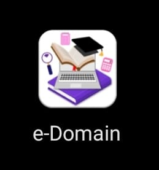
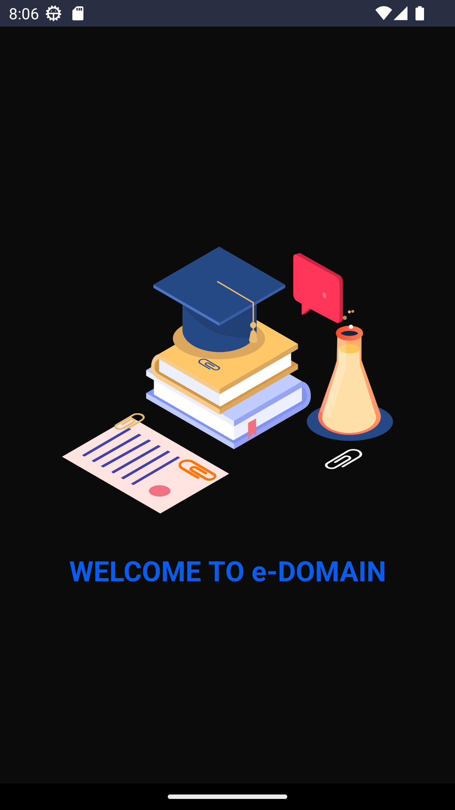
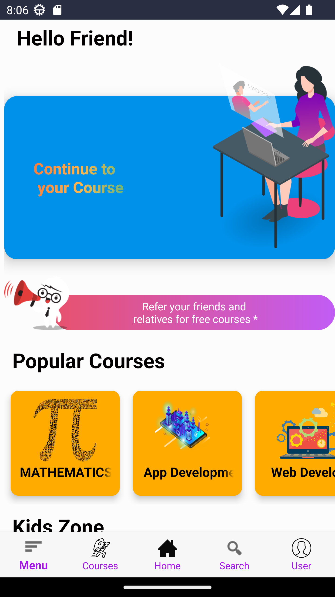
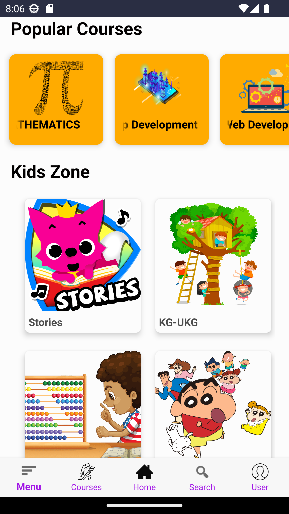
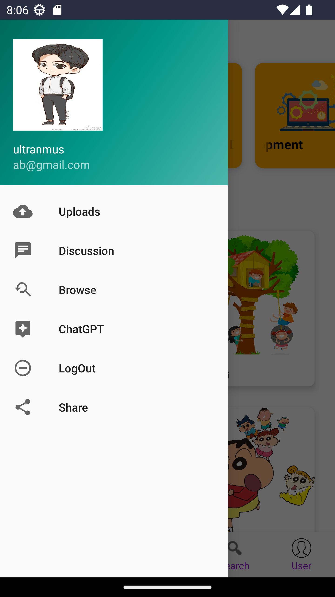
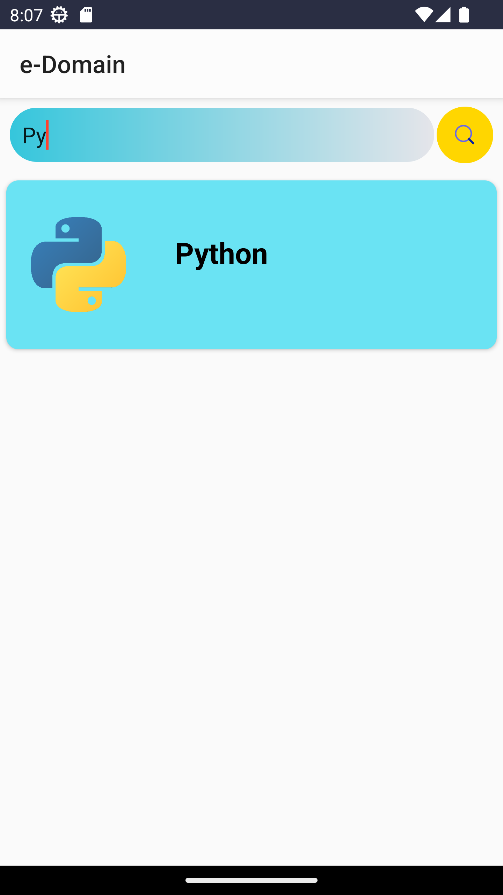
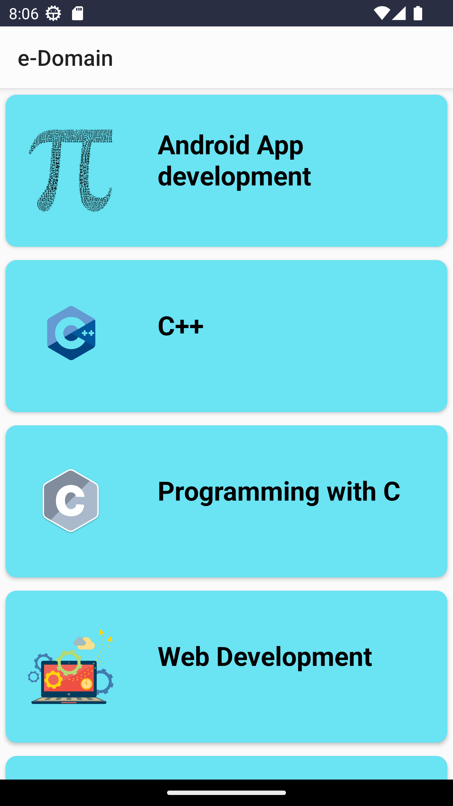
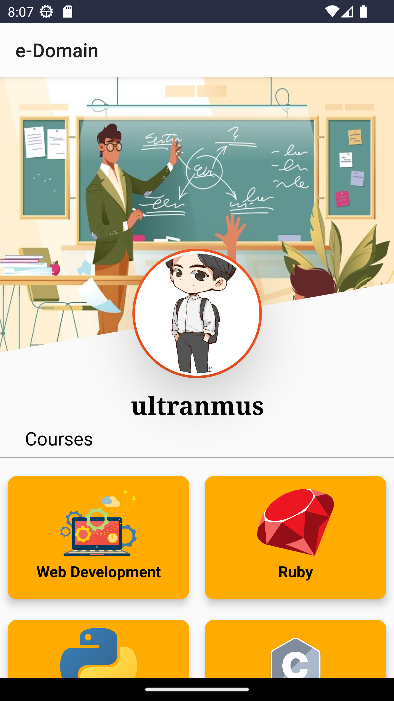
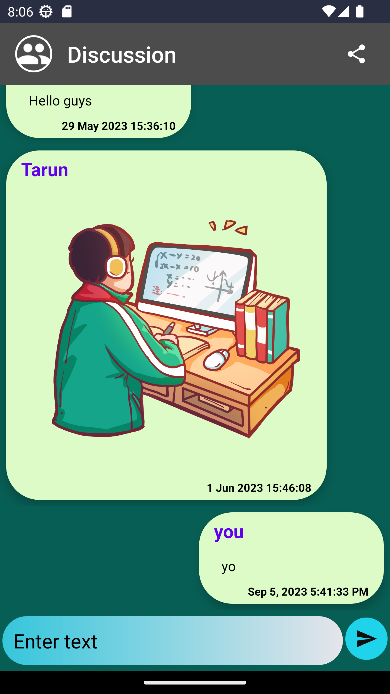

# e-Domain: User-Friendly e-Learning Platform

Welcome to e-Domain, a user-friendly e-Learning platform designed to make learning accessible, interactive, and efficient. Built using Android Java and Firestore, e-Domain offers a range of features to enhance your educational experience, including a chatbot for queries and a discussion area for collaboration.

## Demo Video

 For Demo video [Click here](readme-assets/vid_20230905_204041.mp4)

## Splash Screen

## Home Screen

## Main Menu

## Features

### Study Material Uploads

- **Upload and Share**: Easily upload study materials, including PDFs, videos, images, XLS files, and more, to share with your audience. Teachers and educators can use this feature to provide valuable resources to their students.

- **Quality Assurance**: Before sharing your study materials, use the "Material Preview" option to ensure the quality and accuracy of the content. This helps maintain high standards in your educational offerings.

### Course Search

- **Efficient Search**: Find the courses you need quickly and efficiently using the search functionality. Whether you're a student looking for specific subjects or an instructor promoting your courses, this feature simplifies the process.

### Top Courses Display

- **Discover Popular Courses**: The "Top Courses" section prominently displays the most popular and highly-rated courses. It makes it easy for learners to discover trending content and engage with the best educational resources. Currently, all courses are shown as recommended, but in the future, we can introduce a functionality where top courses are recommended based on views and user preferences.

### KidsZone

- **Child-Friendly Content**: In the "KidsZone" section, children can access admin-uploadable content tailored to their age and learning needs. For example, you can find Panchatantra stories and other educational materials suitable for kids.
- As no content is uploaded , so it will not work.
- But if you want it to work then make a category on firebase for this and fetch from there normally like other courses. But note as this is only for admin , so do not make this category available in app for upload.

### User Profiles

- **Personalized Learning**: Create your user profile to customize your learning experience.

### Chatbot for Queries

- **Ask Questions**: Utilize the built-in chatbot to ask questions, seek clarification, or get assistance with your studies. The chatbot is here to provide quick answers to your queries.

- As openAi disable all publicly available apis. To use this functionality update it with your own apis. Do not use mine.

### Discussion Area

- **Collaborative Learning**: Engage in collaborative learning in the discussion area. Share ideas, resources, and insights with fellow learners and educators through chat. Share various types of files, including images, videos, XLS, and PDFs, to facilitate discussions and enhance the learning experience.

## Contact

If you have any questions, feedback, or suggestions, please feel free to reach out to me:

- **Email**: hashmack17@gmail.com
